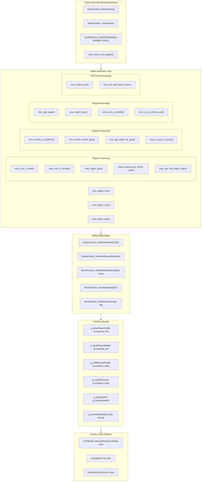
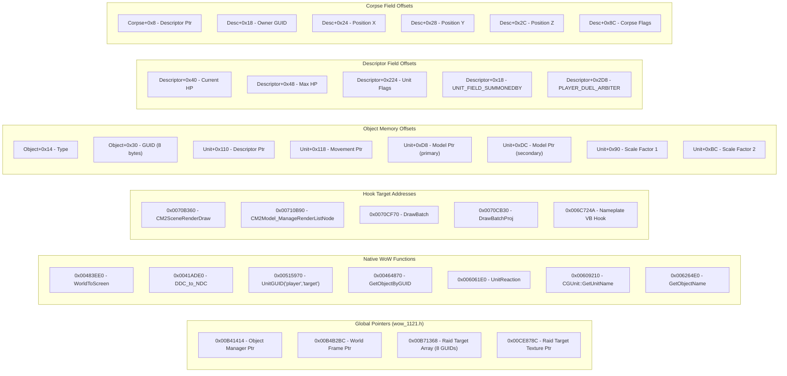
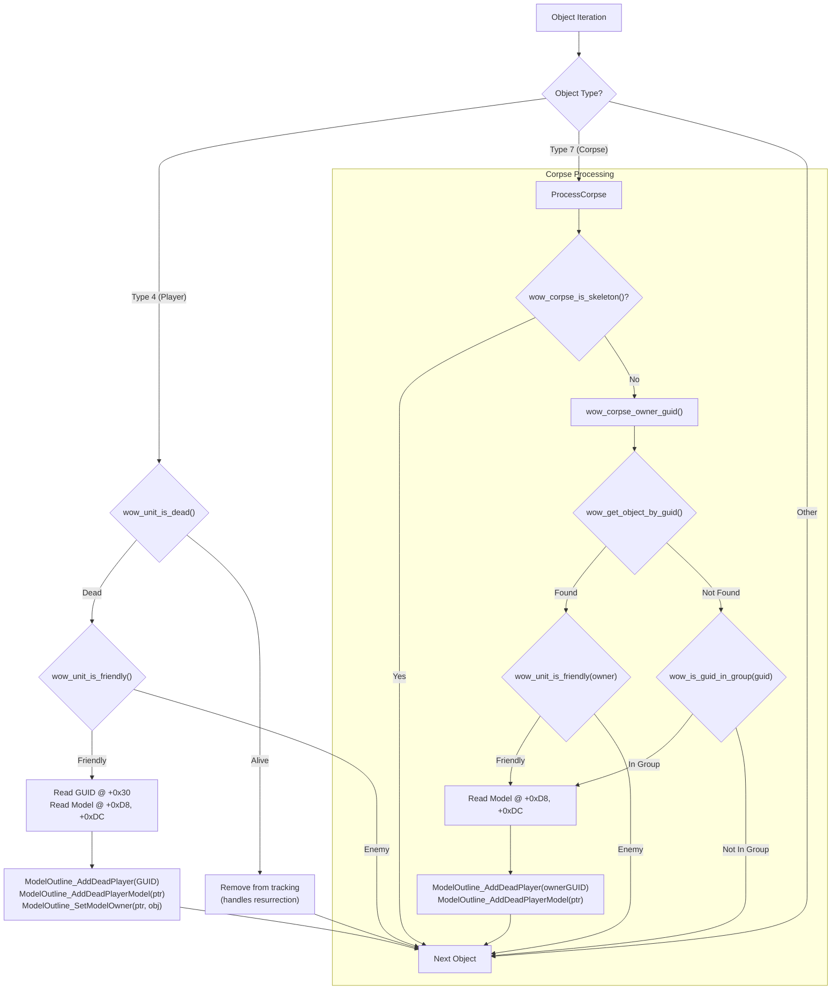
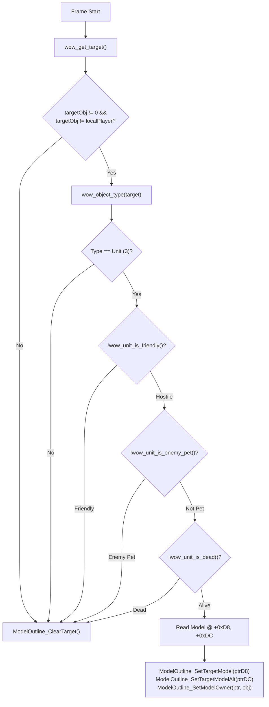
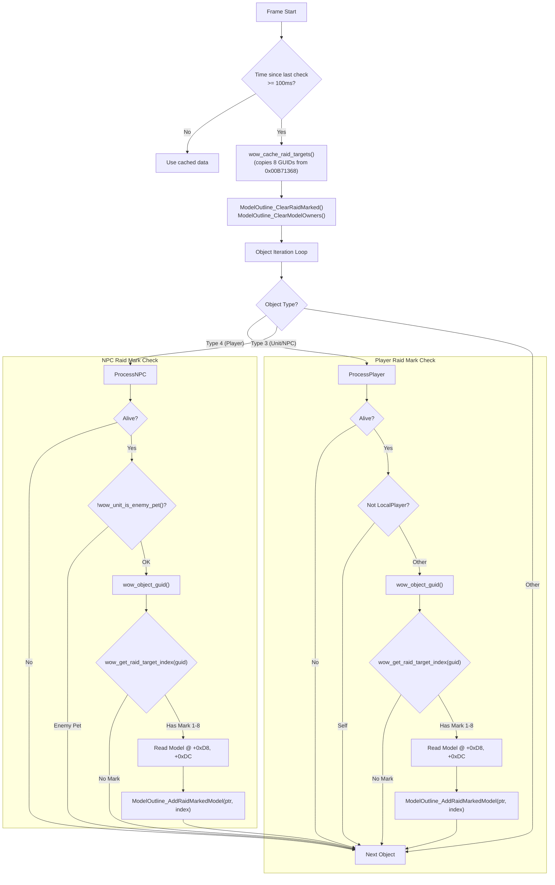
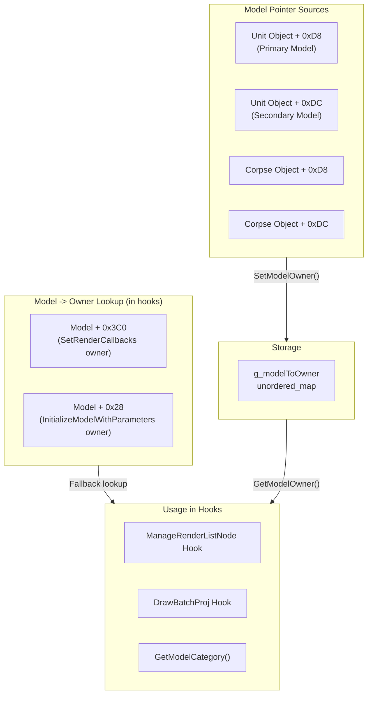
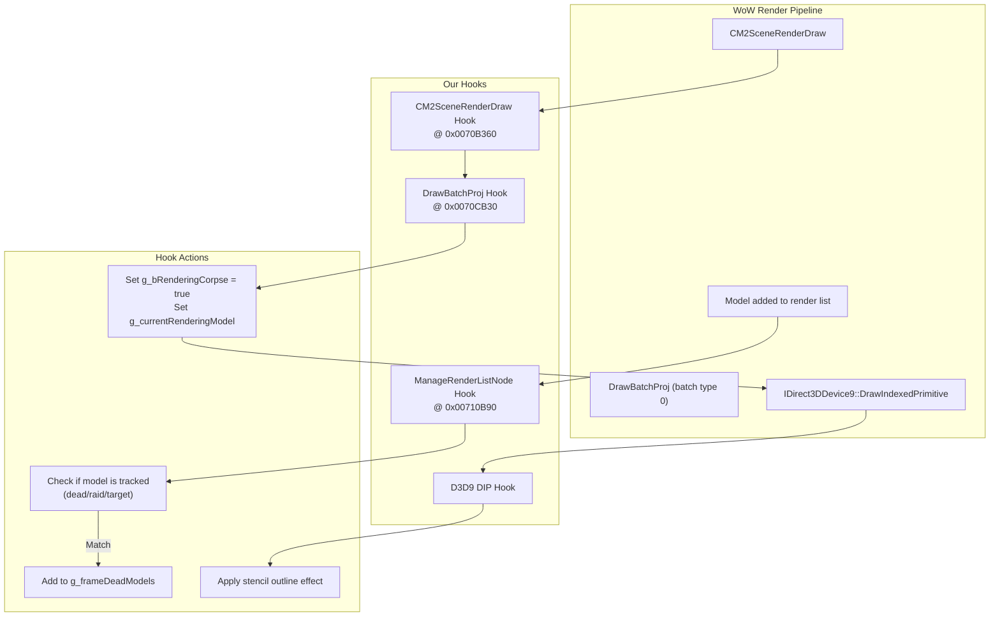
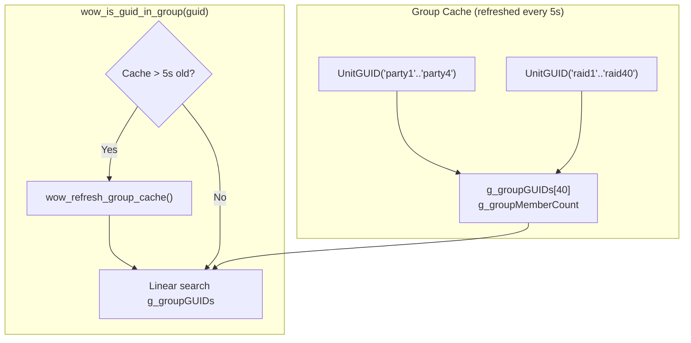

# Data Flow Map: Outline and Overlay Detection System

This document maps how the DLL detects and gathers information for rendering outlines on corpses, targets, and raid-marked units.

## Overview

The system uses multiple data sources and hooks to identify which models should receive outline rendering:

1. **Object Manager Iteration** - Scans all visible game objects each frame
2. **WoW Function Calls** - Uses native game functions for GUID/object resolution
3. **Direct Memory Reads** - Reads game structures at known offsets
4. **Model Render Hooks** - Intercepts WoW's rendering pipeline to associate models with objects

---

## High-Level Data Flow

---

## Memory Address Sources

---

## Detection Flow by Category

### Dead Player Detection

### Target Detection

### Raid Mark Detection

---

## Model-to-Object Linking

---

## Hook Pipeline

---

## Group Membership Detection

---

## Summary: Memory Reads Per Frame

| Operation | Memory Source | Frequency |
|-----------|--------------|-----------|
| Object Iteration | Object Manager @ 0x00B41414 | Every frame, O(n) objects |
| Object Type | Object + 0x14 | Per object |
| Object GUID | Object + 0x30 | Per player/unit/corpse |
| Unit Dead Check | Descriptor + 0x40 (HP), + 0x224 (flags) | Per unit |
| Unit Friendly Check | UnitReaction function call | Per relevant unit |
| Model Pointer | Object + 0xD8, + 0xDC | Per tracked object |
| Raid Targets | 0x00B71368 (8 GUIDs) | Every 100ms |
| Current Target | UnitGUID("target") function | Every frame |
| Group Members | UnitGUID("party#", "raid#") | Every 5 seconds |
| Corpse Owner | Descriptor + 0x18 | Per corpse |
| Corpse Skeleton Flag | Descriptor + 0x8C | Per corpse |

---

## Potential Consolidation Opportunities

1. **Batch GUID Resolution**: Currently `wow_get_raid_target_index()` is called per-object. Could cache GUID->mark_index map once per 100ms.

2. **Unified Object Cache**: Could build a single per-frame cache of {object_ptr, guid, type, model_ptrs, is_dead, is_friendly} to avoid repeated reads.

3. **Reduce Hook Count**: Consider if ManageRenderListNode + DrawBatchProj could be consolidated into a single hook point.

4. **Group Cache Integration**: Group membership check could be integrated with the raid target cache refresh cycle.

5. **Model Owner Association**: Currently done both at detection time AND in hooks via fallback. Could be consolidated to detection-only.
